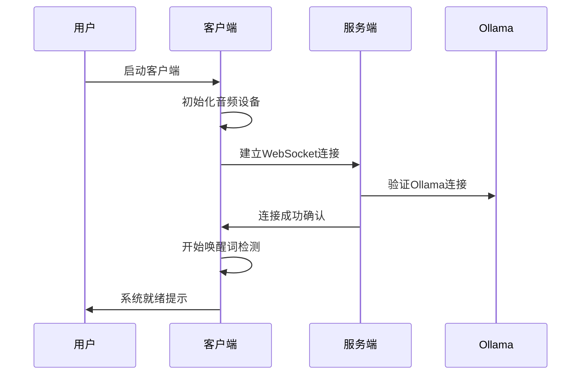
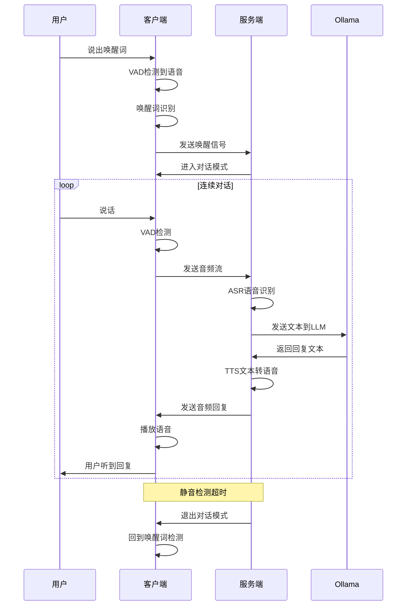
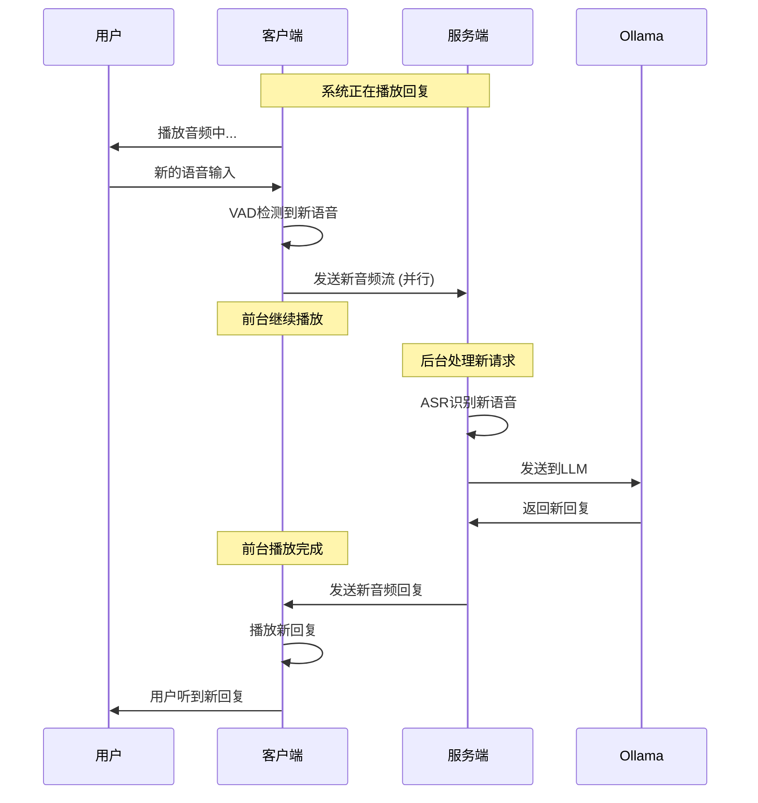

# 语音助手解决方案

## 项目概述

本项目是一个基于Go语言的智能语音助手系统，采用客户端-服务端分离架构，实现了语音识别(ASR)、大语言模型(LLM)对话、语音合成(TTS)的完整语音交互流程。

### 核心特性

1. **连续对话模式**: 系统通过唤醒词唤醒后，可以不断接收用户语音命令，直到静音检测休眠
2. **智能唤醒机制**: 休眠状态需要唤醒词唤醒，对话场景过程中无需唤醒
3. **并发音频处理**: 系统播放过程中，如果接收到用户新的语音，后台转换为文字传输给大模型，不影响前台播放
4. **上下文管理**: 设计用户上下文机制，组织内容提供给大模型，促使更快获得准确答案
5. **客户端-服务端分离**: 客户端轻量化，服务端集中处理重型模型
6. **跨平台支持**: 客户端支持Windows/Linux/macOS多平台

## 架构设计

### 整体架构

```
┌─────────────────┐    WebSocket    ┌─────────────────┐    HTTP/API    ┌─────────────────┐
│   客户端 (轻量)   │ ◄──────────────► │   服务端 (重型)   │ ◄─────────────► │   外部Ollama     │
│                 │                 │                 │                │                 │
│ • 音频输入输出   │                 │ • ASR (FunASR)  │                │ • LLM推理       │
│ • VAD语音检测   │                 │ • TTS (ChatTTS) │                │ • 模型管理       │
│ • WebSocket连接 │                 │ • 会话管理       │                │ • API服务       │
│ • 实时音频流    │                 │ • 消息处理       │                │                 │
└─────────────────┘                 └─────────────────┘                └─────────────────┘
```

### 项目结构

```
voice_assistant/
├── voice_assistant_server/          # 服务端 (Linux部署)
│   ├── cmd/server/                  # 服务端主程序
│   ├── internal/                    # 内部实现
│   │   ├── asr/                     # ASR模块 (FunASR, OpenAI)
│   │   ├── llm/                     # LLM模块 (Ollama, OpenAI, WebSocket)
│   │   ├── tts/                     # TTS模块 (ChatTTS, Edge-TTS)
│   │   ├── websocket/               # WebSocket服务器
│   │   └── processor/               # 消息处理器
│   ├── config/                      # 配置文件
│   ├── scripts/                     # 部署脚本
│   ├── Dockerfile                   # Docker镜像
│   ├── docker-compose.yml          # 容器编排
│   └── DEPLOYMENT.md               # 部署文档
├── voice_assistant_client/          # 客户端 (跨平台)
│   ├── cmd/client/                  # 客户端主程序
│   ├── internal/                    # 内部实现
│   │   ├── audio/                   # 音频处理
│   │   ├── websocket/               # WebSocket客户端
│   │   ├── vad/                     # VAD检测
│   │   └── ui/                      # 用户界面
│   ├── config/                      # 配置文件
│   ├── Makefile                     # 跨平台构建
│   └── BUILD.md                     # 构建文档
└── pkg/protocol/                    # 通信协议包
```

## 业务流程

### 1. 系统启动流程



### 2. 语音交互流程



### 3. 并发处理流程



## 接口设计

### 1. WebSocket通信协议

#### 消息类型定义

```go
// 消息类型
type MessageType string

const (
    MessageTypeAudioStream MessageType = "audio_stream"  // 音频流
    MessageTypeCommand     MessageType = "command"       // 命令
    MessageTypeResponse    MessageType = "response"      // 响应
    MessageTypeStatus      MessageType = "status"        // 状态
    MessageTypeError       MessageType = "error"         // 错误
)

// 基础消息结构
type Message struct {
    Type      MessageType `json:"type"`
    ID        string      `json:"id"`
    Timestamp int64       `json:"timestamp"`
    Data      interface{} `json:"data"`
}
```

#### 音频流消息

```go
// 音频流数据
type AudioStreamData struct {
    SessionID    string  `json:"session_id"`
    SequenceID   int     `json:"sequence_id"`
    AudioData    []byte  `json:"audio_data"`    // Base64编码的PCM数据
    SampleRate   int     `json:"sample_rate"`   // 采样率
    Channels     int     `json:"channels"`      // 声道数
    BitsPerSample int    `json:"bits_per_sample"` // 位深度
    IsEnd        bool    `json:"is_end"`        // 是否结束
}
```

#### 命令消息

```go
// 命令类型
type CommandType string

const (
    CommandTypeWakeUp     CommandType = "wake_up"      // 唤醒
    CommandTypeSleep      CommandType = "sleep"        // 休眠
    CommandTypeReset      CommandType = "reset"        // 重置
    CommandTypeStatus     CommandType = "status"       // 状态查询
    CommandTypeConfig     CommandType = "config"       // 配置更新
)

// 命令数据
type CommandData struct {
    Command   CommandType `json:"command"`
    SessionID string      `json:"session_id"`
    Params    map[string]interface{} `json:"params,omitempty"`
}
```

#### 响应消息

```go
// 响应类型
type ResponseType string

const (
    ResponseTypeASR      ResponseType = "asr"           // ASR结果
    ResponseTypeLLM      ResponseType = "llm"           // LLM回复
    ResponseTypeTTS      ResponseType = "tts"           // TTS音频
    ResponseTypeStatus   ResponseType = "status"        // 状态信息
    ResponseTypeError    ResponseType = "error"         // 错误信息
)

// 响应数据
type ResponseData struct {
    Type      ResponseType `json:"type"`
    SessionID string       `json:"session_id"`
    Content   interface{}  `json:"content"`
    Success   bool         `json:"success"`
    Message   string       `json:"message,omitempty"`
}
```

### 2. ASR接口设计

```go
// ASR接口
type ASRInterface interface {
    // 批量识别
    Recognize(ctx context.Context, audioData []byte, config ASRConfig) (*ASRResult, error)
    
    // 流式识别
    RecognizeStream(ctx context.Context, audioStream <-chan []byte, config ASRConfig) (<-chan *ASRResult, error)
    
    // 实时识别
    RecognizeRealTime(ctx context.Context, audioData []byte, config ASRConfig) (*ASRResult, error)
    
    // 健康检查
    HealthCheck(ctx context.Context) error
}

// ASR配置
type ASRConfig struct {
    Language    string  `json:"language"`     // 语言
    SampleRate  int     `json:"sample_rate"`  // 采样率
    Channels    int     `json:"channels"`     // 声道数
    Format      string  `json:"format"`       // 格式
    EnableVAD   bool    `json:"enable_vad"`   // 启用VAD
    Timeout     int     `json:"timeout"`      // 超时时间
}

// ASR结果
type ASRResult struct {
    Text        string  `json:"text"`         // 识别文本
    Confidence  float64 `json:"confidence"`   // 置信度
    Duration    float64 `json:"duration"`     // 音频时长
    Language    string  `json:"language"`     // 识别语言
    IsEnd       bool    `json:"is_end"`       // 是否结束
    Timestamp   int64   `json:"timestamp"`    // 时间戳
}
```

### 3. LLM接口设计

```go
// LLM接口
type LLMInterface interface {
    // 对话
    Chat(ctx context.Context, messages []Message, config LLMConfig) (*LLMResponse, error)
    
    // 流式对话
    ChatStream(ctx context.Context, messages []Message, config LLMConfig) (<-chan *LLMResponse, error)
    
    // 健康检查
    HealthCheck(ctx context.Context) error
}

// LLM配置
type LLMConfig struct {
    Model       string  `json:"model"`        // 模型名称
    Temperature float64 `json:"temperature"`  // 温度
    MaxTokens   int     `json:"max_tokens"`   // 最大令牌数
    TopP        float64 `json:"top_p"`        // Top-P采样
    Stream      bool    `json:"stream"`       // 流式输出
    Timeout     int     `json:"timeout"`      // 超时时间
}

// LLM消息
type LLMMessage struct {
    Role    string `json:"role"`    // 角色 (user/assistant/system)
    Content string `json:"content"` // 内容
}

// LLM响应
type LLMResponse struct {
    Content     string  `json:"content"`      // 回复内容
    Usage       Usage   `json:"usage"`        // 使用统计
    Model       string  `json:"model"`        // 使用模型
    IsEnd       bool    `json:"is_end"`       // 是否结束
    Timestamp   int64   `json:"timestamp"`    // 时间戳
}
```

### 4. TTS接口设计

```go
// TTS接口
type TTSInterface interface {
    // 文本转语音
    Synthesize(ctx context.Context, text string, config TTSConfig) (*TTSResult, error)
    
    // 流式合成
    SynthesizeStream(ctx context.Context, text string, config TTSConfig) (<-chan *TTSResult, error)
    
    // 健康检查
    HealthCheck(ctx context.Context) error
}

// TTS配置
type TTSConfig struct {
    Voice      string  `json:"voice"`       // 音色
    Speed      float64 `json:"speed"`       // 语速
    Pitch      float64 `json:"pitch"`       // 音调
    Volume     float64 `json:"volume"`      // 音量
    Format     string  `json:"format"`      // 输出格式
    SampleRate int     `json:"sample_rate"` // 采样率
    Timeout    int     `json:"timeout"`     // 超时时间
}

// TTS结果
type TTSResult struct {
    AudioData   []byte  `json:"audio_data"`   // 音频数据
    Duration    float64 `json:"duration"`     // 音频时长
    Format      string  `json:"format"`       // 音频格式
    SampleRate  int     `json:"sample_rate"`  // 采样率
    Channels    int     `json:"channels"`     // 声道数
    IsEnd       bool    `json:"is_end"`       // 是否结束
    Timestamp   int64   `json:"timestamp"`    // 时间戳
}
```

## 技术实现

### 1. 服务端技术栈

- **Web框架**: Gin + WebSocket
- **ASR引擎**: FunASR (默认), OpenAI Whisper
- **LLM引擎**: Ollama (默认), OpenAI GPT, WebSocket
- **TTS引擎**: ChatTTS (默认), Edge-TTS, Sherpa-ONNX
- **容器化**: Docker + Docker Compose
- **监控**: Prometheus + Grafana
- **配置**: YAML配置文件

### 2. 客户端技术栈

- **音频处理**: PortAudio
- **WebSocket**: Gorilla WebSocket
- **VAD检测**: 自实现VAD算法
- **跨平台构建**: Go交叉编译
- **配置**: YAML配置文件

### 3. 通信协议

- **传输协议**: WebSocket (实时双向通信)
- **数据格式**: JSON + Base64 (音频数据)
- **音频格式**: PCM 16kHz 16bit
- **压缩**: 可选Gzip压缩
- **认证**: 可选Token认证

## 部署方案

### 1. 服务端部署

#### Docker容器化部署

```bash
# 基础模式 (仅服务端)
docker-compose up -d voice-assistant-server

# 监控模式 (服务端 + 监控)
docker-compose --profile monitoring up -d
```

#### 系统要求

- **CPU**: 2核心以上 (推荐4核心)
- **内存**: 4GB以上 (推荐8GB)
- **存储**: 20GB以上可用空间
- **网络**: 稳定的互联网连接
- **外部依赖**: Ollama服务

### 2. 客户端部署

#### 跨平台编译

```bash
# 构建所有平台
make build-all

# 构建特定平台
make build-windows
make build-linux
make build-darwin

# 生成发布包
make release
```

#### 支持平台

- **Windows**: amd64, 386, arm64
- **Linux**: amd64, 386, arm64, arm
- **macOS**: amd64, arm64

## 性能优化

### 1. 音频处理优化

- **VAD优化**: 自适应阈值算法
- **音频缓冲**: 环形缓冲区设计
- **格式转换**: 高效的PCM/Float32转换
- **并发处理**: 音频输入输出并发

### 2. 网络优化

- **连接池**: WebSocket连接复用
- **压缩**: 音频数据压缩传输
- **重连机制**: 自动重连和心跳检测
- **流量控制**: 音频流量控制

### 3. 模型优化

- **模型选择**: 根据硬件选择合适模型
- **缓存策略**: 模型结果缓存
- **批处理**: 批量处理提高效率
- **并发推理**: 多线程并发推理

## 监控告警

### 1. 系统监控

- **资源监控**: CPU、内存、磁盘使用率
- **网络监控**: 连接数、流量统计
- **应用监控**: 请求延迟、错误率
- **业务监控**: 识别准确率、响应时间

### 2. 告警规则

- **资源告警**: 资源使用超过阈值
- **错误告警**: 错误率超过阈值
- **性能告警**: 响应时间超过阈值
- **连接告警**: 连接数异常

## 扩展性设计

### 1. 水平扩展

- **无状态设计**: 服务端无状态，支持多实例
- **负载均衡**: 支持负载均衡器
- **会话管理**: 分布式会话存储
- **消息队列**: 异步消息处理

### 2. 功能扩展

- **插件系统**: 支持ASR/LLM/TTS插件
- **多语言支持**: 支持多种语言识别和合成
- **多模态**: 支持图像、视频等多模态输入
- **API扩展**: 提供RESTful API接口

## 安全考虑

### 1. 数据安全

- **数据加密**: 音频数据传输加密
- **数据脱敏**: 敏感信息脱敏处理
- **数据留存**: 合规的数据留存策略
- **访问控制**: 基于角色的访问控制

### 2. 系统安全

- **身份认证**: 客户端身份认证
- **授权机制**: 细粒度授权控制
- **防火墙**: 网络访问控制
- **日志审计**: 完整的操作日志

## 总结

本语音助手解决方案采用现代化的微服务架构，实现了完整的语音交互功能。通过客户端-服务端分离设计，既保证了客户端的轻量化，又实现了服务端的高性能处理。系统具有良好的扩展性、可维护性和安全性，能够满足各种场景的语音交互需求。

### 核心优势

1. **架构清晰**: 客户端-服务端分离，职责明确
2. **性能优异**: 并发处理，实时响应
3. **易于部署**: Docker容器化，一键部署
4. **跨平台**: 支持多平台客户端
5. **可扩展**: 插件化设计，易于扩展
6. **高可用**: 完善的监控和告警机制

### 适用场景

- **智能客服**: 语音客服系统
- **智能家居**: 语音控制系统
- **教育培训**: 语音交互学习
- **办公助手**: 语音办公助手
- **车载系统**: 车载语音交互
